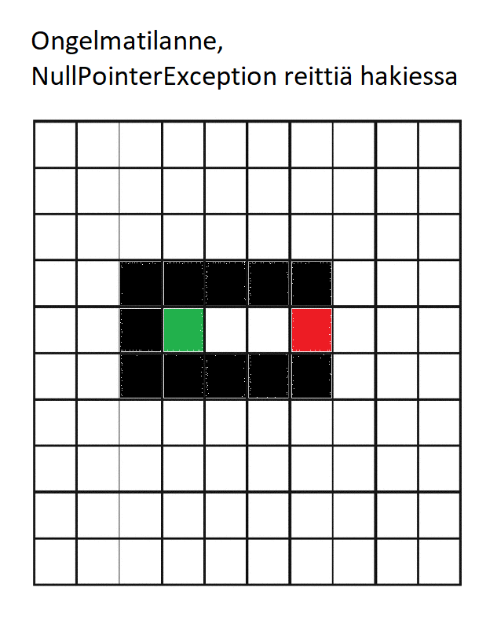

# Viikkoraportti3

## Mitä olen tehnyt tällä viikolla?
Korjailin BFS-algoritmia, josta paljastui yllättäviä ongelmia toiminnan suhteen ja aloin lopultakin työstämään Dijkstran algoritmia.
Samalla toteutin Dijkstraa varten pinon rakenteen.

## Miten ohjelma on edistynt?
Ohjelman edistyminen hidastui BFS-algoritmin ongelmien vuoksi jonkin verran, enkä ole saanut 2. algoritmia vielä toimimaan kunnolla.

## Mitä opin tällä viikolla?
Opin hiukan Dijkstran toteuttamiseen liittyvistä ongelmsita.

## Miikä jäi epäselväksi tai on tuottanut vaikeuksia?
BFS-algoritmi tuotti paljon hankaluuksia, sillä se etsi reittiä usein ruudukon reunoilta asti koukaten tai jätti toimimatta ollenkaan,
jos aloitus- tai lopetusruudun lähellä oli liikaa esteitä. Nyt ongelmana on enää sivuttaissuuntainen tunneli, missä algoritmi ei osaa etsiä
reittiä, ks. alla oleva kuva.

Dijkstrassa on myös jotain ongelmia, sillä se ei osaa tunnistaa välillä aloitus- tai lopetusruutua, välillä taas osaa ja löytääkin reitin.

## Mitä teen seuraavaksi
Koitan vielä korjailla BFS-algoritmia ja Dijkstraa.

Viikon työtunnit: 6h

